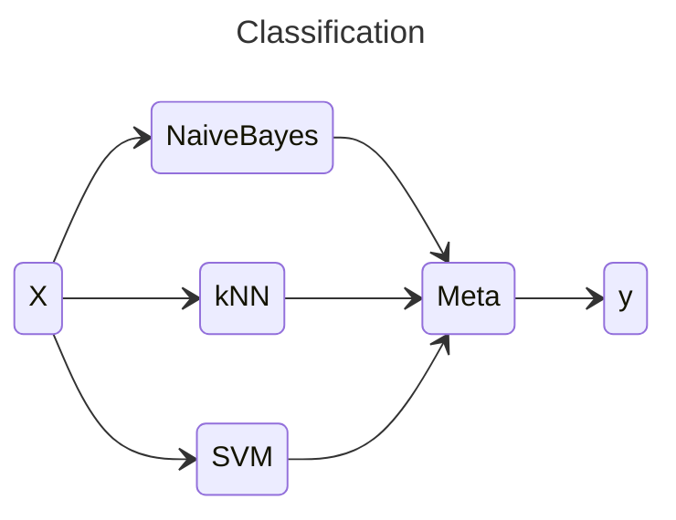
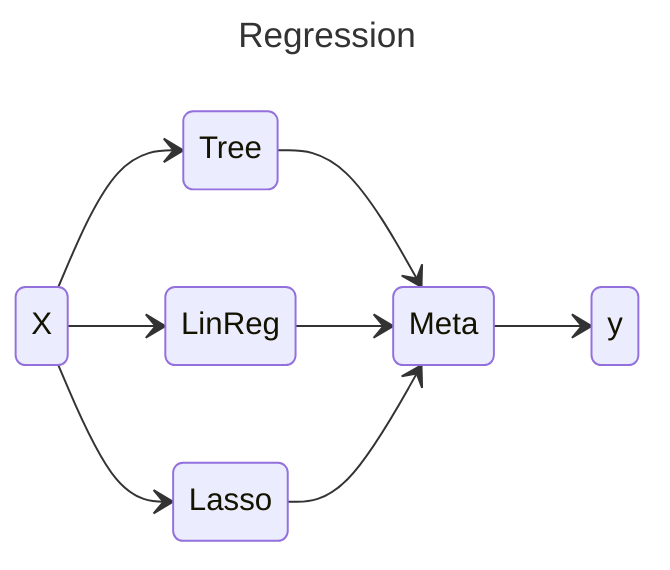

# Model Stacking

* Basic idea: use the output of multiple models (**base models**) as input to a **meta-model**

* We ‘stack’ the meta-model on top of the base models
 
 

---

# Model Stacking Example

* Suppose four people throw a combined 187 darts at a board
* For 150 of those we get to see who threw each dart and where it landed
* For the rest, we only get to see where the dart landed
* Our task is to guess who threw each of the unlabelled darts based on their landing spot

---

# Model Stacking Example

<figure>
  
  <figcaption style="color:#b3b3b3ff; font-size: 11px;">Image source:  <a href="https://www.gormanalysis.com/blog/guide-to-model-stacking-i-e-meta-ensembling/">https://www.gormanalysis.com/blog/guide-to-model-stacking-i-e-meta-ensembling/</a>
  </figcaption>
</figure>

---

# Stacking Approach

* Let’s consider the regression case
* Base model predictions are $f_1(x), ..., f_L(x)$
* Meta learner could be a simple linear combination 
$f_\mathrm{meta} (x) = \sum\limits_{i=1}^L w_i f_i (x)$
* If we could choose $w$ to minimize true error, the stacked model would always be at least as good as any base model!
	* Worst case we set all $w_i$ to $0$ except that of the best base model
* But what if we minimize the train error instead?

---

# Stacking Approach

#### Consider the following base models:
 

<figure>
  
  <figcaption style="color:#b3b3b3ff; font-size: 11px;">Image source:  <a href="https://www.cs.mcgill.ca/~hvanho2/comp551/Lectures/12Stacking_Features.pdf">https://www.cs.mcgill.ca/~hvanho2/comp551/Lectures/12Stacking_Features.pdf</a>
  </figcaption>
</figure>
 

* What weights would minimize train set error?
* Does that yield good generalization error for the meta model?

---

# Stacking Approach
 

* Now, we can train the meta-model on the data in the base
model outputs paired with the target label

* Any base-model output is now a good indication of test-time
behavior

* If the meta-model has free parameters itself, can cross-validate
using the same folds

* Usually, the meta-model is relatively simple
	* Linear regression or logistic regression

---

# Comparison to model selection

* If we force meta-learner to use just one base model (with weight 1) and set all other weights to 0, this is equivalent to selecting the best model with cross-validation

* More expressive meta-models (e.g. linear / logistic regression) can leverage the relative strength of multiple models

* A very complex meta-model (e.g. decision tree) could again easily overfit

* Could use cross-validation on the meta-level to ensure good generalization properties

---

# Effectiveness of stacking

* Stacking generally improves performance, but not by much

* Additional cost of training and evaluating multiple models

* Depending on conditions, it might or might not be worth it:
	* If interpretability or latency are important consideration, stacking might not help you much
	* In competitions where a small gain is important and time cost is not so much of an issue, it is usually effective!
	* Quite useful in collaborative approaches where everyone can integrate their own model in overall system